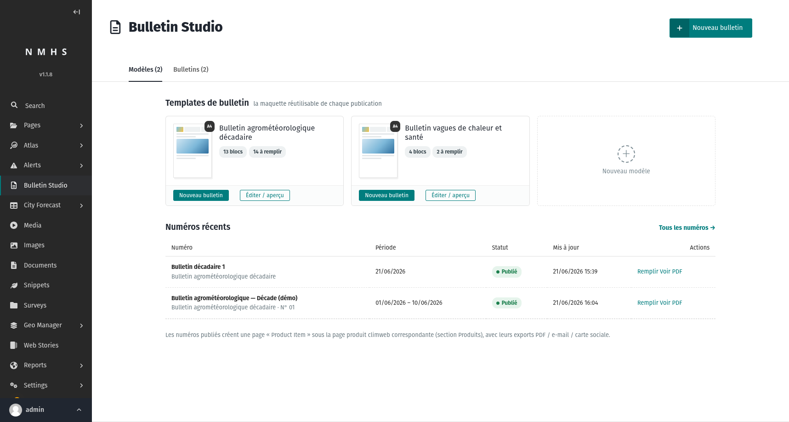
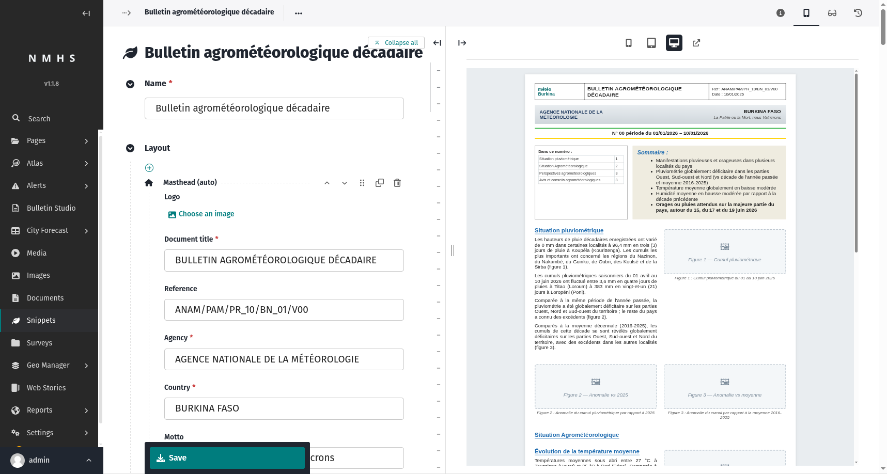
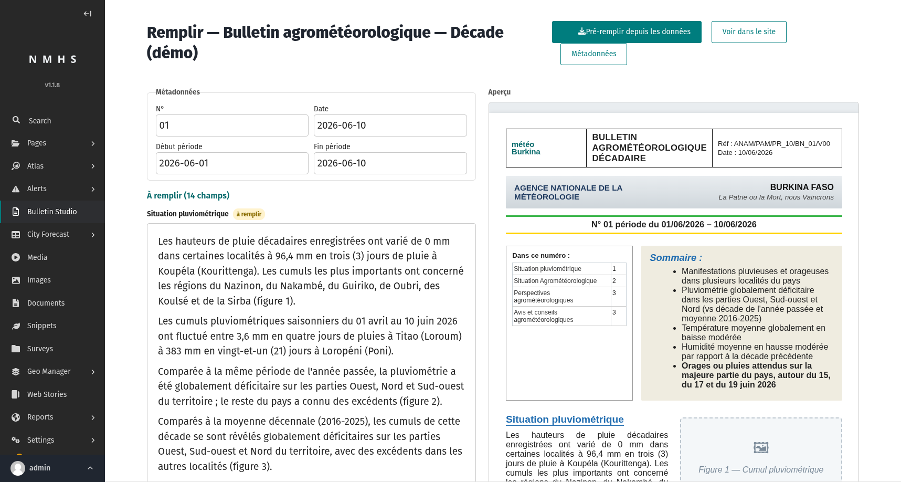
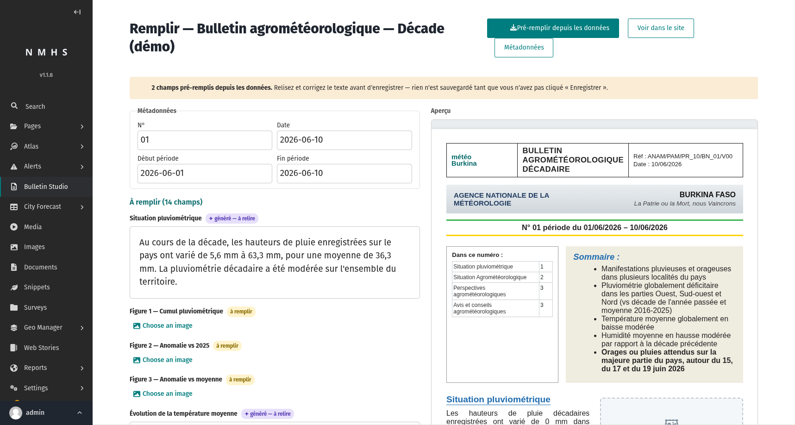
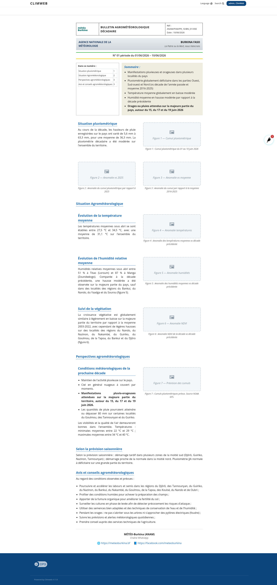
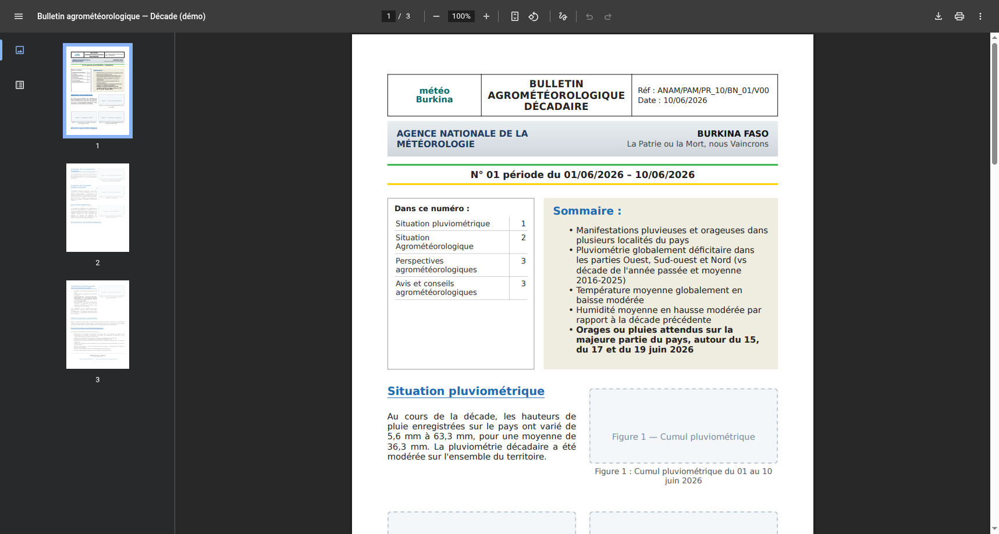
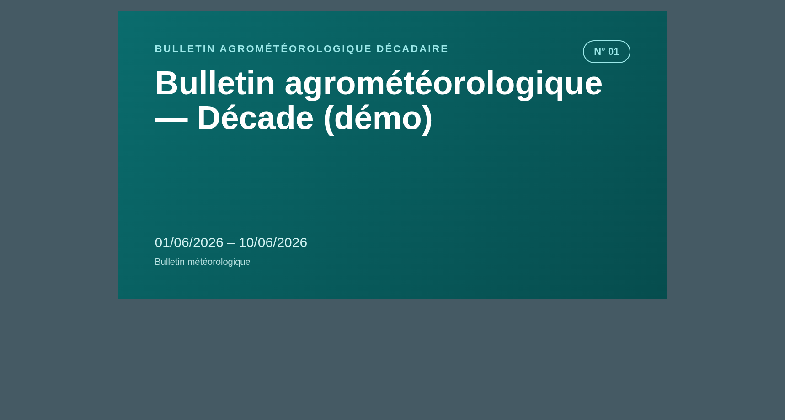
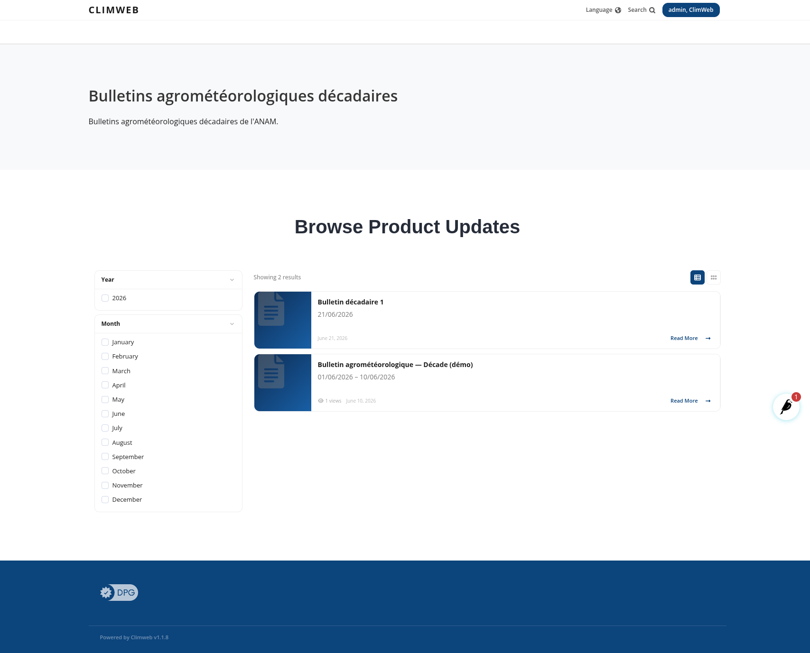

# Bulletin Studio — POC

> Proof of concept for the **Bulletin Studio** plugin for Climweb.
> Screenshots taken on the dev environment (Climweb v1.1.8, ANAM Burkina Faso data).
> For decisions and detailed status, see [`SPECIFICATION.md`](SPECIFICATION.md).

---

## 1. In one sentence

A bulletin is no longer **a PDF you build elsewhere and upload**, but **a structured HTML page** produced from a **reusable template**; the PDF, the email and the social card are **derived renderings**, and the content can be **auto-filled** from data already present in Climweb.

> **One source = the page. N renderings = web, PDF, email, social.**

---

## 2. What it changes compared to the current workflow

### The native Climweb workflow (products / pages / services)

In Climweb today, a bulletin is published as a **product**:

```
HomePage → ProductIndexPage → ProductPage → ProductItemPage
                                  │              │
                          (linked to the      StreamField "products":
                           Product + Service   document_product block → uploaded PDF
                           snippets)
```

The editor **builds the bulletin outside Climweb** (Word, InDesign…), **exports a PDF**, **uploads it to the Documents library**, then creates a `ProductItemPage` and **attaches the PDF** through a `DocumentChooserBlock`. The public page then shows an **auto-generated thumbnail** + a **download button**. *Services* (`ServiceCategory`) are used to group products by theme.

The PDF is **opaque**: free-form layout (redone every time), a single format, non-reusable content, no generation possible.

### BEFORE vs AFTER

| Aspect | **BEFORE** — native Climweb | **AFTER** — Bulletin Studio |
|---|---|---|
| **Nature of the bulletin** | A finished PDF, uploaded then attached (`document_product`) | A structured **Wagtail HTML page** |
| **Source of truth** | The PDF file (binary, opaque) | The page's **structured content** (slots in the DB) |
| **Layout** | Redone by hand, outside Climweb, every issue | **Modeled once** (locked structure), reused |
| **Producing an issue** | Write → export PDF → upload → create the page → pick the doc | Pick the template → **fill a short form** → publish |
| **Output formats** | 1 (the PDF + thumbnail) | **N**: web, PDF, email, social card — *one* source |
| **Visual consistency** | Depends on the PDF's author | **Guaranteed by the template** (branding, structure) |
| **Content reuse** | None (opaque PDF) | Content is **reusable, indexable, translatable** |
| **Automatic generation** | Impossible | **Possible**: slots pre-filled from data |
| **Place in the site** | Products section | **Unchanged** — still a `ProductItemPage` |

Key point: **we don't leave Climweb's Products model**. The bulletin *is* a `ProductItemPage` (approach A) — it keeps its place, its filters and its native listing (see §4.6). We enrich *how it is produced*, without breaking *where it lives*.

---

## 3. The chosen approach (3 decisions)

1. **The bulletin is a Wagtail HTML page** that *is* a Climweb `ProductItemPage` (subclass). → stays in the Products section; PDF/email/social are renderings derived from a single source.
2. **Editing through slots, on a template with a locked structure.** The *template* owns the layout (block palette); each *issue* only fills slots, via a **short form** — not the full page editor. The editor cannot break the structure.
3. **Rule-based automatic generation.** Text slots are pre-filled from **geomanager raster data** (rainfall totals, anomalies, temperatures…) via **deterministic rules** (thresholds → sentences). A human reviews and corrects before publishing.

---

## 4. Walkthrough (real screens)

### 4.1 The dashboard

A single menu entry **"Bulletin Studio"**. Native Wagtail styling: available templates (cards) and recent issues.



### 4.2 The template (locked structure + live preview)

A template is a *snippet* whose layout is a StreamField (block palette: masthead, summary, fixed text, **text slot**, **image slot**, map, **two columns**, footer…). Live preview on the right. This is where the branding of a bulletin type is defined **once**.



### 4.3 Filling an issue — short form

For an issue, the editor only sees the **fields to fill** (one per slot), with native Wagtail widgets (rich text editor, image chooser) and a **live preview**. The structure itself is locked.



### 4.4 ⭐ Pre-fill from data (the heart of the POC)

One click on **"Pré-remplir depuis les données"** ("Pre-fill from data"): the engine reads numeric values from geomanager raster layers, applies the template's rules, and **writes the text** into the relevant slots.



Here, two slots were generated (banner "2 fields pre-filled", **✦ généré — à relire** = "generated — to review" pills):

- *Rainfall situation* → "…rainfall totals ranged from **5.6 mm** to **63.3 mm**, for an average of **36.3 mm**. Decadal rainfall was **moderate**…"
- *Mean temperature trend* → "…between **27.5 °C** and **34.5 °C**, with an average of **31.1 °C**…"

The numbers (mean / min / max) come from **zonal** statistics computed over the Burkina Faso extent; the qualifier ("moderate") comes from a **threshold** declared in the rule. Deterministic: same data + same rules → same text. **Nothing is saved** until the editor has reviewed and clicked "Enregistrer" (Save).

> ⚠️ In this demo, the raster layers are **synthetic** (`bulletin_studio_demo_data` command) — there is no real ANAM data feed wired in yet. The extraction mechanism, however, is real.

### 4.5 The published page + derived renderings

The published issue is an **HTML page** in the site (generated text appears in the sections; image slots remain to be filled):



The **same source** produces a **PDF** (weasyprint, multi-page)…



…and a **social card** (sharing / Open Graph):



### 4.6 Still in the "Products" section

The bulletin remains a Climweb product: it shows up in the native "Browse Product Updates" listing, with the standard **year / month filters**.



---

## 5. How generation works (under the hood)

```
geomanager raster layer (GeoTIFF/NetCDF, per date)
        │   get_geostore_data() / get_raster_pixel_data()   ← native geomanager helpers
        ▼
data_sources.extract_measurement(spec, issue)   → a number (mean/sum/min/max over a zone, or value at a point)
        │
        ▼
generation.generate_slot_values(template, issue)   → { slot : HTML }
        │   template rules (generation_rules):
        │     • measurements : which values to extract
        │     • text         : sentence template "… {cumul_moyen} mm … {tendance}"
        │     • bands        : thresholds → qualitative word (deficient / moderate / abundant…)
        ▼
Fill form (field initial values)  →  human reviews  →  publishes
```

The rules live on the template (`SlotBulletinTemplate.generation_rules`, JSON, key = slot label). The engine is **AI-free**: it only substitutes formatted numbers (French decimal comma) and threshold words. A slot with no available data is simply left empty (no invention).

---

## 6. Status & next steps

**Done and verified end to end**: templates with a locked structure • fill form + live preview • web / PDF / email / social renderings • Products integration • **rule-based automatic generation** (raster extraction → French text).

**Possible next steps:**
- **Generate the image/map** of an `image_slot` from a layer (today: text only).
- **LLM text** on top of the rule-based draft, for non-purely-numeric passages.
- **Wire in real data** (ANAM feed) instead of the demo layers.
- **Admin UI** to edit the rules (today seeded by a command).

---

*Screenshots: `docs/poc/`. Reproduce the demo: `climweb bulletin_studio_bad` + `bulletin_studio_demo_data` + `bulletin_studio_setup_products`, then the "Bulletin Studio" menu → an issue → "Pré-remplir depuis les données".*
